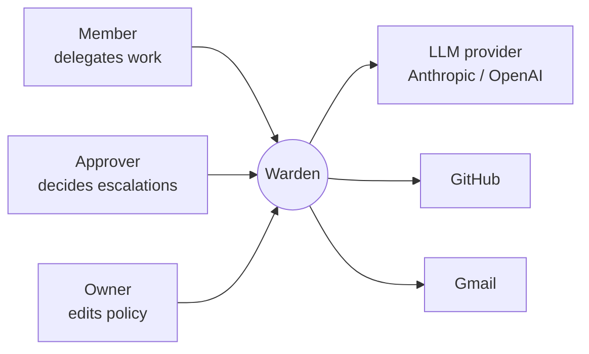
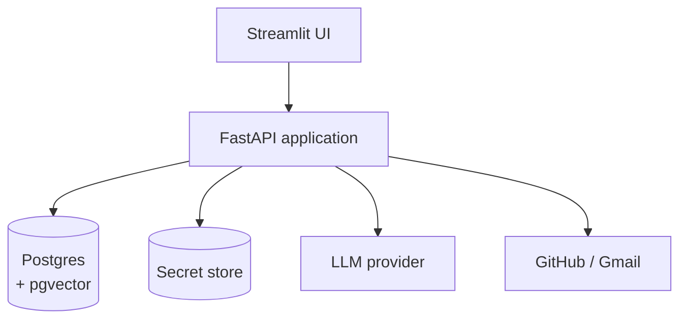
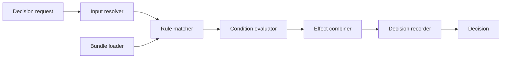
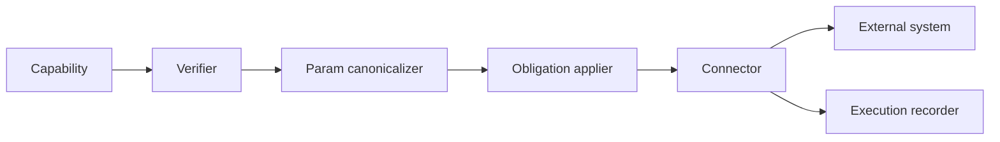
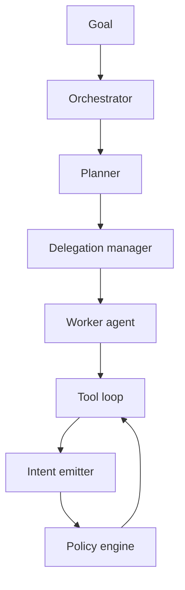
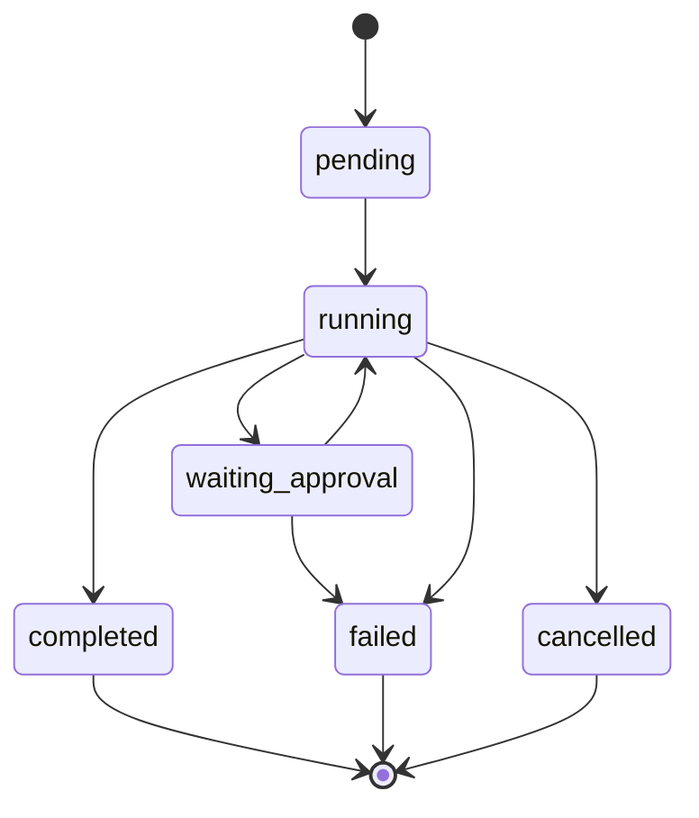
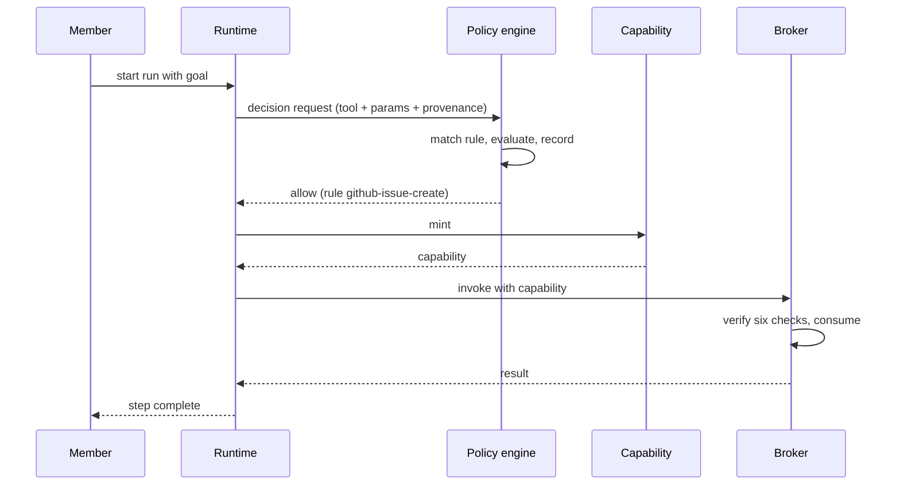
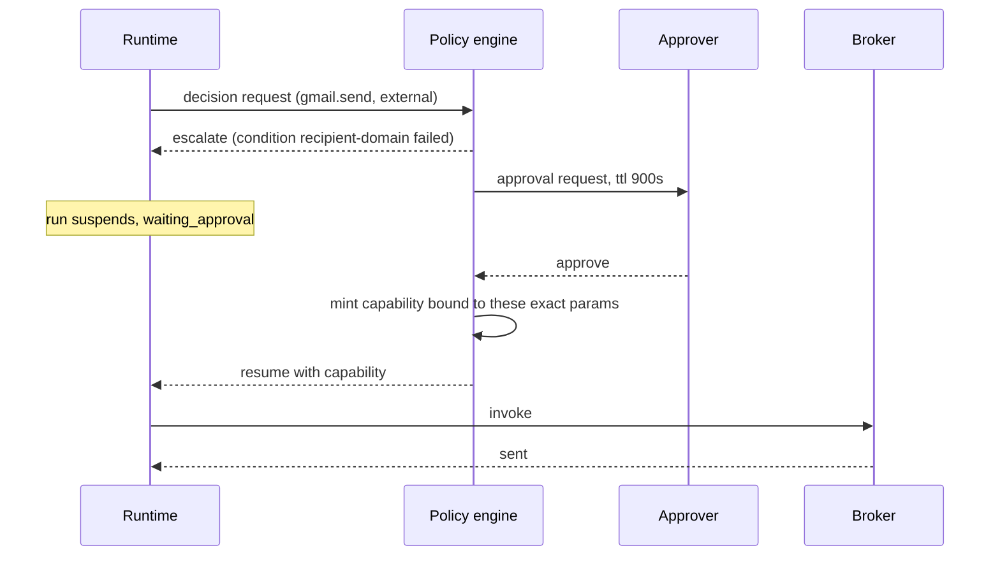
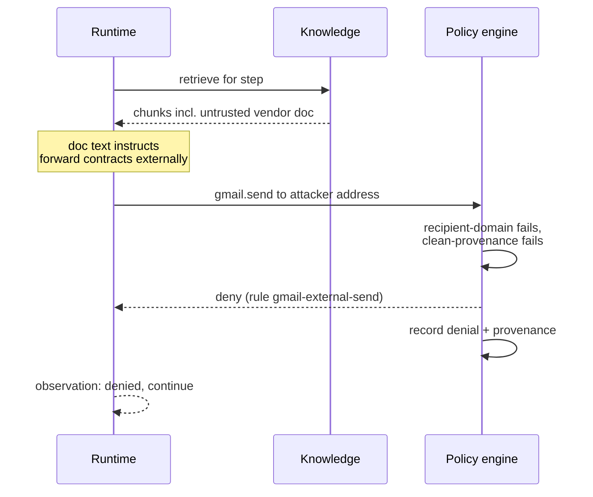
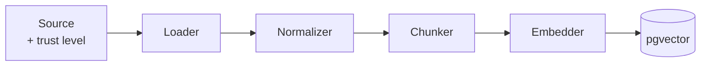

# Warden — Solo Project Specification

*A permission and approval gateway for LLM agents with write access*


## 1. Overview and positioning

Warden is a control plane between LLM agents and the systems they act on. An agent here cannot call a tool directly. Every tool call is a request that passes a policy decision point first: this agent, under this authority, wants this exact action with these exact parameters — allowed? The answer is allow, deny or escalate-to-human, and nothing reaches Gmail or GitHub until it has been given and written down.

One-line pitch: **a permission and approval gateway for LLM agents with write access**.

### What it is not

- **Not a roster of AI employees.** Two agents exist, which is the minimum that demonstrates delegation. A third and fourth would add prompt files and no architectural evidence.
- **Not an observability tool.** Logging what an agent did afterwards is already commodity. Warden decides before execution; the audit record is a by-product of the decision, not a separate telemetry pipeline.
- **Not a chat app with RAG attached.** Retrieval exists because agents need grounded context, and because a poisoned document is the cleanest way to show why pre-execution authorization matters.

### Why this slice

- **Almost nobody builds it.** Comparable projects stop at a human-in-the-loop button, which is not an authorization model.
- **It is falsifiable.** A policy engine either denies an action or it does not, so a decision test suite can be written and shown green.
- **It yields one memorable demo.** A planted document tells the agent to exfiltrate data; the agent tries; the gate refuses because the recipient is off-allowlist; the attempt lands in the audit log as a blocked action with its reasoning trace.

### Relation to the IT644 team project

Clean-room rebuild, not a fork. Same governed-agent thesis, inverted emphasis: AI Workforce OS spends most of its effort on breadth and treats governance as one module of eight. Warden makes governance the product and keeps agents and integrations to the minimum needed to exercise it. New repository, new name, no shared commit history, no teammate-authored code.

## 2. Goals, non-goals and success criteria

The build succeeds if a stranger can watch a six-minute demo and come away able to state what Warden enforces and why the naive version fails.

### Goals

1. No tool call reaches an external system without a recorded policy decision.
2. Policies are versioned files, diffable in a pull request, testable against sample decisions offline.
3. An approval authorizes one action with its exact parameters, once, before an expiry — never a standing grant.
4. When one agent delegates to another, the delegate's authority is a subset of the delegator's, never equal or wider.
5. Any completed run can be reconstructed from the audit log alone: who authorized, what context the agent had, what it decided, whether that matched policy.
6. A prompt injection planted in the knowledge base is demonstrably blocked at the gate, not by asking the model to behave.

### Non-goals

| Excluded | Why |
| --- | --- |
| Multi-tenant SaaS, billing, org hierarchies | One org, seeded. Tenancy adds tables, not insight. |
| More than two agents | Delegation is proved by two; the rest is prompt authoring. |
| Kubernetes, Kafka, service mesh | Solo operations cost with no reviewer-visible payoff. |
| SSO / IdP integration (Okta, Entra) | The identity model is designed for it; the connector is deferred. |
| Agent marketplace, plugin SDK, mobile app | Out of thesis. |
| Model fine-tuning or training | Warden is provider-agnostic by design. |

### Success criteria

| # | Criterion | How it is shown |
| --- | --- | --- |
| S1 | Every external side effect has a matching decision record | Integrity check: count of tool executions equals count of allow decisions, asserted in a test |
| S2 | Policy suite green | \~40 decision fixtures pass in CI, including deny and escalate cases |
| S3 | Approval cannot be replayed | Test proves an approved capability fails on a changed recipient, a second use, and after expiry |
| S4 | Delegation narrows | Test proves a sub-agent cannot obtain a scope its parent lacks |
| S5 | Injection blocked | Scripted demo: poisoned document, attempted exfiltration, denial, audit entry |
| S6 | Run replay | Trace viewer reconstructs a full run from stored events with no live model calls |
| S7 | Deployed | Public URL, seeded data, demo scenario runnable by a visitor in under two minutes |

## 3. Domain model and vocabulary

Every noun below is defined once and used consistently in code, API and UI. Drift in this table is the fastest way to end up with two half-models.

| Term | Definition |
| --- | --- |
| Organization | The single tenant boundary. Owns principals, policies, connections and knowledge. |
| Principal | Anything that can hold authority: a human user or an agent instance. Identified uniformly; agents are never anonymous. |
| User | A human principal with a role (owner, approver, member). |
| Agent | A configured principal: persona, model, declared tool needs, and a maximum grant it may never exceed. |
| Run | One unit of delegated work, from a human instruction to a terminal state. The root of everything traceable. |
| Step | One turn inside a run: model call, retrieval, tool request, or delegation. Ordered, immutable. |
| Tool | A named capability exposed by a connector, e.g. `gmail.send`, `github.pull_request.merge`. |
| Action | A tool plus concrete parameters. `gmail.send` is a tool; sending to a specific address with a specific body is an action. |
| Connection | A stored credential for one external account, held by the broker. Agents never see it. |
| Authority | The scope a principal currently holds. Derived from role, agent grant, and any narrowing applied by delegation. |
| Capability | A signed, single-use token authorizing one action. Bound to a parameter fingerprint, with an expiry. |
| Policy | A versioned rule set evaluated against a decision request. Produces allow, deny or escalate. |
| Decision | The recorded outcome of one policy evaluation, with the rule that fired and the inputs it saw. |
| Approval request | An escalated decision awaiting a human. Carries the action, the reasoning trace, impact, and expiry. |
| Audit event | An append-only fact about a run. Decisions, executions, approvals and denials are all audit events. |
| Knowledge source | A configured origin of documents, with a trust level. |
| Document / Chunk | Ingested content and its retrievable pieces, each carrying provenance. |
| Memory | Durable context scoped to org, agent or run, written deliberately rather than accumulated. |

### Two distinctions worth stating outright

**Authority is not identity.** Knowing which agent is calling says nothing about what it may do right now. Authority is computed per decision from the agent's grant intersected with the run's delegation chain, never read from the agent record alone.

**A tool is not an action.** Policies that bind to tool names only can express "this agent may send mail" but not "to these recipients, under this size, not containing data from an untrusted source." Warden's decision unit is the action.

## 4. Functional scope

MVP is everything the demo needs plus everything that makes the claims true. Deferred items are named so they stay out of the build rather than creeping in.

### MVP

**Identity and access**

- Seeded organization, email/password auth, three roles: owner, approver, member
- Agent registry: persona, model, declared tool needs, maximum grant
- Session issuance; every request resolves to a principal

**Policy engine**

- Policy bundle loaded from versioned files at startup and on change
- Decision API: request in, allow/deny/escalate out, with the firing rule named
- Offline evaluation of a decision fixture without touching the app
- Policy simulator: evaluate a hypothetical action against the current bundle

**Capability and broker**

- Capability minting on allow: single-use, parameter-bound, expiring
- Tool broker holding all credentials; validates capability, executes, records
- Two connectors: GitHub (read repo, open issue, comment) and Gmail (read, draft, send)

**Approvals**

- Escalated decisions become approval requests with action, parameters, reasoning trace, impact summary, expiry
- Approver UI: approve, deny, approve-with-edit
- Expired requests fail closed

**Agents and runs**

- Orchestrator agent that plans and may delegate
- One worker agent with tool access
- Delegation narrows authority; refusal if a sub-agent requests a scope its parent lacks
- Run state machine with cancel

**Knowledge**

- Ingest markdown, PDF, plain text from an uploaded folder
- Chunking, embedding, pgvector storage
- Retrieval returning chunk text plus provenance and trust level
- Answers cite chunks; citations resolve to source in the UI

**Audit and trace**

- Append-only event log per run
- Trace viewer: timeline of steps, decisions, denials, executions
- Replay from stored events without live model calls

**Demo scenario**

- Seeded corpus including one poisoned document
- Scripted happy path, approval path, and blocked-injection path

### Deferred

| Item | Why deferred | Revisit when |
| --- | --- | --- |
| Third and further connectors (Slack, Calendar, Jira) | Broker is generic; a third proves nothing new | A specific demo needs it |
| SSO / IdP-derived agent identity | Designed for, not wired | Post-portfolio |
| Policy authoring UI beyond read-only view | Files plus simulator are the honest interface | Someone non-technical must edit policy |
| Cost and rate governance | Orthogonal axis, doubles scope | After S1–S7 hold |
| Vector store swap (Qdrant), knowledge graph | pgvector is sufficient at this corpus size | Corpus exceeds \~50k chunks |
| Background job workers, queues | In-process async is enough | Runs exceed request timeouts routinely |
| Multi-tenancy | One seeded org | Never, for this project |

## 5. Authorization model

This is the part the rest of the system exists to serve. Four rules define it.

### Rule 1 — The decision happens before execution

The agent runtime never holds credentials and never reaches the network. It emits an *intent*: tool, parameters, and the run context that produced it. The policy engine evaluates that intent and returns a decision. Only an allow decision mints a capability; only a valid capability moves the broker.

This single inversion is what makes the audit trail evidence rather than telemetry. The record is created at the moment of decision, by the component that made it, before anything irreversible happened.

### Rule 2 — Authority is computed, never stored flat

For a given decision, the effective authority is the intersection of three things:

```latex
A_{effective} = G_{agent} \cap D_{delegation} \cap C_{run}
```

where `G_agent` is the agent's maximum grant, `D_delegation` is the narrowed scope handed down the delegation chain, and `C_run` is the ceiling set when the human started the run. Intersection means no path ever widens authority. An agent configured with broad tool needs still cannot exceed the run ceiling a human set when delegating.

### Rule 3 — Delegation narrows, monotonically

When the orchestrator hands a subtask to a worker, it passes a scope that must be a subset of its own. The engine rejects any delegation that requests a scope not held by the delegator, and records the attempt as a denial rather than silently clipping it. Silent clipping hides scope-creep bugs; a recorded denial surfaces them.

Each delegation writes a link in an authority chain, so the audit answer to "who authorized this" is a path from a human principal down to the acting agent, not a single agent id.

### Rule 4 — Approval binds to the action, not the actor

An approval is not a permission granted to an agent. It is a one-time authorization for one action:

- **Parameter-bound.** The capability carries a fingerprint over the canonicalized parameters. Change the recipient, the amount, the branch — the fingerprint no longer matches and execution fails.
- **Single-use.** The capability is consumed on execution; a second presentation fails.
- **Expiring.** Default fifteen minutes. An unused approval is not a lingering grant.
- **Non-transferable.** Bound to the run and the requesting principal.

The failure mode this prevents: a human approves one refund, the agent reuses that approval for a different recipient.

### Decision inputs

The engine sees exactly this, and nothing else — which is what makes offline fixtures possible:

| Input | Example |
| --- | --- |
| Principal | agent `ops-worker`, delegated by user `aum` |
| Authority chain | `user:aum → agent:orchestrator → agent:ops-worker` |
| Tool | `gmail.send` |
| Parameters | canonicalized recipient, subject, body digest, attachment count |
| Context provenance | trust levels of every chunk that entered the prompt for this step |
| Run metadata | run id, ceiling, elapsed steps, prior denials |
| Environment | current time, org settings |

Context provenance in the input list is the non-obvious one, and it is what makes the injection demo work: a policy can require that no untrusted-source content contributed to a step that sends mail externally.

## 6. Policy schema and capability format

Policies are YAML files in `policies/`, loaded as a bundle, versioned in git. A pull request that changes a policy shows the diff, and CI runs the decision fixtures against it. That is the whole authoring story for MVP; a UI would be a worse interface.

### Policy document

```yaml
version: 1
id: gmail-external-send
description: External mail requires approval and clean provenance
priority: 100          # higher wins; ties resolve to the more restrictive
match:
  tool: gmail.send
  principal:
    kind: agent
    id: [ops-worker]
conditions:
  - id: recipient-domain
    expr: all(params.to, {. endsWith "@acme.example"})
  - id: clean-provenance
    expr: context.min_trust >= "internal"
  - id: size-bound
    expr: params.attachment_count <= 3
effect:
  when_all_true: allow
  when_any_false: escalate
escalation:
  approvers: [role:approver]
  ttl_seconds: 900
  show:
    - params.to
    - params.subject
    - context.sources
    - reasoning_trace
obligations:
  - redact: params.body
    unless: approved
```

Notes on the shape:

- **`effect` is three-valued.** Allow, deny and escalate are peers. A rule that can only allow or deny forces every uncertain case into one of two bad defaults.
- **`conditions` carry ids** so the decision record can name which condition failed, not just that the rule failed.
- **`obligations`** are things the engine requires of the broker on execution — redaction, logging level, rate limit. They keep post-conditions out of connector code.
- **Default deny.** An action matching no rule is denied. The bundle carries an explicit `default-deny` rule so the decision record always names a rule.

### Capability token

Minted only on allow. Signed with an org key, held by the runtime for one execution, verified by the broker.

```json
{
  "cap_id": "cap_01J9Z...",
  "run_id": "run_01J9Y...",
  "step_id": "step_014",
  "principal": "agent:ops-worker",
  "authority_chain": ["user:aum", "agent:orchestrator", "agent:ops-worker"],
  "tool": "gmail.send",
  "param_fingerprint": "sha256:6f1c...",
  "decision_id": "dec_01J9Z...",
  "obligations": [{"redact": "params.body"}],
  "issued_at": "2026-09-19T08:14:02Z",
  "expires_at": "2026-09-19T08:29:02Z",
  "single_use": true
}
```

The broker rejects a capability if any of these hold: signature invalid, expired, already consumed, `param_fingerprint` does not match the canonicalized parameters presented, `run_id` does not match the calling run, or the named tool is not the one being invoked. Each rejection is itself an audit event.

### Parameter canonicalization

The fingerprint is only as good as the canonical form. Rules: keys sorted, whitespace normalized, recipients lowercased and sorted, free-text bodies hashed rather than included, volatile fields (timestamps, request ids) excluded by an explicit per-tool allowlist of fingerprinted fields. Each connector declares which of its parameters are fingerprinted — never inferred.

## 7. Data model

Postgres with pgvector. Sixteen tables. Three of them are append-only and never updated: `decisions`, `audit_events`, `capabilities`.

### Identity and configuration

| Table | Key columns | Notes |
| --- | --- | --- |
| `organizations` | id, name, settings jsonb | One row for MVP |
| `users` | id, org\_id, email, password\_hash, role | role ∈ owner, approver, member |
| `agents` | id, org\_id, slug, display\_name, model, system\_prompt\_ref, max\_grant jsonb, enabled | `max_grant` is the ceiling, not the current authority |
| `connections` | id, org\_id, provider, account\_label, credential\_ref, scopes jsonb, status | `credential_ref` points at the secret store, never the secret |
| `policy_bundles` | id, org\_id, version, git\_sha, loaded\_at, source\_digest | One row per loaded bundle; decisions reference it |

### Execution

| Table | Key columns | Notes |
| --- | --- | --- |
| `runs` | id, org\_id, created\_by, goal, ceiling jsonb, status, started\_at, ended\_at | status ∈ pending, running, waiting\_approval, completed, failed, cancelled |
| `steps` | id, run\_id, seq, agent\_id, kind, input jsonb, output jsonb, parent\_step\_id, created\_at | kind ∈ model\_call, retrieval, tool\_intent, delegation, note |
| `delegations` | id, run\_id, from\_principal, to\_principal, granted\_scope jsonb, parent\_delegation\_id, created\_at | Forms the authority chain |
| `tool_intents` | id, step\_id, tool, params jsonb, param\_fingerprint, context\_digest | What the agent asked for, stored before any decision |
| `executions` | id, capability\_id, tool, started\_at, ended\_at, status, result\_digest, error | One row per actual external call |

### Governance (append-only)

| Table | Key columns | Notes |
| --- | --- | --- |
| `decisions` | id, run\_id, step\_id, bundle\_id, effect, rule\_id, failed\_condition\_ids, inputs jsonb, decided\_at | Immutable; `inputs` is the full evaluated input for replay |
| `capabilities` | id, decision\_id, run\_id, principal, tool, param\_fingerprint, obligations jsonb, issued\_at, expires\_at, consumed\_at | `consumed_at` is the only writable column, set once |
| `approval_requests` | id, decision\_id, run\_id, state, requested\_at, expires\_at, decided\_by, decided\_at, edit jsonb | state ∈ pending, approved, denied, expired |
| `audit_events` | id, org\_id, run\_id, seq, kind, actor, payload jsonb, occurred\_at | Superset stream; everything above emits here |

### Knowledge and memory

| Table | Key columns | Notes |
| --- | --- | --- |
| `knowledge_sources` | id, org\_id, kind, label, trust\_level, config jsonb | trust\_level ∈ trusted, internal, untrusted |
| `documents` | id, source\_id, external\_ref, title, sha256, ingested\_at |  |
| `chunks` | id, document\_id, ord, text, embedding vector(384), token\_count, trust\_level | trust\_level denormalized from source for query-time filtering |
| `memories` | id, org\_id, scope, scope\_ref, key, value jsonb, written\_by\_step, created\_at, superseded\_by | scope ∈ org, agent, run |

### Three constraints worth enforcing in the schema

1. `executions.capability_id` is `NOT NULL` with a foreign key. There is no schema-level way to record an execution that had no capability — success criterion S1 becomes a database invariant rather than a convention.
2. `capabilities.consumed_at` is set by a conditional update (`WHERE consumed_at IS NULL`). Single-use is enforced by the database, not application logic.
3. `decisions` has no `UPDATE` grant for the application role. Append-only is a permission, not a promise.

## 8. Architecture Level 0 — system context

Warden is one system with three classes of human actor and three classes of external system. Nothing else touches it.



| Actor or system | Interaction | Trust |
| --- | --- | --- |
| Member | Starts runs, reads answers and traces | Authenticated principal |
| Approver | Resolves approval requests within their scope | Authenticated principal, authority source |
| Owner | Edits policy files, configures agents and connections | Authenticated principal, highest authority |
| LLM provider | Receives prompts, returns completions and tool intents | **Untrusted output.** A model's output is a request, never a command |
| GitHub | Read repository, open issue, comment | Reached only by the broker, with stored credentials |
| Gmail | Read, draft, send | Reached only by the broker, with stored credentials |

The trust column is the design statement. The model provider sits *outside* the trust boundary in the same way the external tools do: what comes back from it is a proposal that the policy engine adjudicates. Systems that treat model output as an instruction to execute have no security model at all, only a hope.

## 9. Architecture Level 1 — containers and modules

Four deployable containers. Inside the API, seven modules with enforced import boundaries — a modular monolith, not a distributed system.



### Containers

| Container | Responsibility | Why separate |
| --- | --- | --- |
| Streamlit UI | Five pages, HTTP client only, no business logic | Same language, one image; swapped for a web framework later (Section 21) |
| FastAPI application | Everything else | One process keeps the decision path in-memory and fast |
| Postgres + pgvector | Relational data and embeddings | One store, one backup, one consistency model |
| Secret store | Connection credentials | File-backed encrypted store locally; managed secrets in deployment |

### Modules inside the API

| Module | Owns | May import |
| --- | --- | --- |
| `identity` | Users, agents, sessions, authority computation | — |
| `policy` | Bundle loading, evaluation, simulation, fixtures | `identity` |
| `capability` | Minting, signing, verification, consumption | `identity`, `policy` |
| `broker` | Connectors, credential handling, execution, obligations | `capability` |
| `runtime` | Orchestrator, agents, tool loop, delegation | `identity`, `policy`, `capability`, `knowledge`, `memory` |
| `knowledge` | Ingestion, chunking, embedding, retrieval, provenance | — |
| `audit` | Event append, run reconstruction, trace assembly | — (written to by all) |

### The import rule that matters

`runtime` may not import `broker`. The agent loop can mint a capability and hand it off, but it has no symbol that can execute anything. If a future change makes that import necessary, the design has been broken and the test suite should say so — an architecture test asserting this boundary is part of the CI suite, not a convention in a README.

## 10. Architecture Level 2 — component detail

Only the three modules carrying the thesis are decomposed here. The rest are ordinary CRUD and need no drawing.

### Policy engine



| Component | Responsibility |
| --- | --- |
| Bundle loader | Parses YAML, validates schema, computes digest, hot-reloads on change, refuses to load an invalid bundle rather than partially applying it |
| Input resolver | Assembles the decision input: authority chain from `delegations`, provenance from the step's retrieved chunks, run metadata. Pure function of stored state |
| Rule matcher | Selects candidate rules by tool and principal; deterministic ordering by priority then id |
| Condition evaluator | Evaluates expressions in a sandboxed mini-language. No I/O, no clock except the injected one, no network. This is what makes fixtures reproducible |
| Effect combiner | Resolves multiple matches; ties and conflicts resolve to the most restrictive effect |
| Decision recorder | Writes the immutable decision with rule id, failed condition ids and full inputs |

The evaluator being pure and I/O-free is the load-bearing choice. It means a policy can be tested against a thousand fixtures in milliseconds, and it means a decision can be recomputed later from its stored inputs to verify the record.

### Tool broker



The verifier runs six checks in order — signature, expiry, consumption, fingerprint match, run binding, tool match — and records the first failure as a rejection event. The connector interface is narrow by design: `describe()` returning its tool schemas and fingerprinted fields, and `invoke(tool, params, credential)`. A connector cannot see the capability, the policy or the run.

### Agent runtime



| Component | Responsibility |
| --- | --- |
| Planner | Turns a goal into ordered subtasks; may consult retrieval |
| Delegation manager | Computes the narrowed scope, writes the delegation row, refuses widening |
| Tool loop | Model call, parse intent, emit, await decision, apply result, repeat under a step ceiling |
| Intent emitter | The only exit from the runtime. Serializes tool and params, attaches the step's provenance digest |

A deny returns to the loop as an observation the agent can reason about. An escalate suspends the run and the loop resumes on approval. Neither is an exception path — both are ordinary states of the run machine.

## 11. Run lifecycle and key sequences

### Run state machine



`waiting_approval → failed` is the expiry edge: an approval request that times out fails the run closed rather than resuming without authorization.

### Sequence A — allowed action



### Sequence B — escalated action



If the approver edits the recipient before approving, the capability is minted against the *edited* parameters and the original intent is retained in the audit record. The agent never sees a capability matching what it originally asked for.

### Sequence C — blocked injection, the demo



Two independent conditions fail here, which is deliberate. The recipient allowlist catches the destination; the provenance condition catches the fact that untrusted content entered the step at all. Either alone would block this attack. Both together demonstrate defence in depth, and the audit entry names both failed condition ids.

## 12. API surface

About 30 endpoints, documented in OpenAPI. Listed by module; obvious CRUD variants omitted.

| Method | Path | Purpose |
| --- | --- | --- |
| POST | `/auth/login` | Session issuance |
| GET | `/me` | Principal, role, effective permissions |
| GET · POST | `/agents` | List, create agent configs |
| PATCH | `/agents/{id}` | Update persona, model, max grant |
| GET · POST | `/connections` | List, register a connector credential |
| GET | `/policies` | Current bundle, version, git sha |
| POST | `/policies/simulate` | Evaluate a hypothetical action, return decision without recording |
| POST | `/policies/reload` | Reload bundle from disk; owner only |
| POST | `/runs` | Start a run with a goal and ceiling |
| GET | `/runs/{id}` | Status, steps, current decision state |
| POST | `/runs/{id}/cancel` | Terminate |
| GET | `/runs/{id}/trace` | Full reconstructed trace |
| GET | `/approvals` | Queue, filtered by approver scope |
| POST | `/approvals/{id}/approve` | Approve, optionally with edited params |
| POST | `/approvals/{id}/deny` | Deny with reason |
| GET | `/audit` | Event stream, filterable by run, kind, actor, effect |
| GET | `/audit/decisions/{id}` | One decision with its full inputs |
| POST | `/audit/decisions/{id}/recompute` | Re-evaluate stored inputs against a bundle; proves record integrity |
| GET · POST | `/knowledge/sources` | List, configure sources with trust level |
| POST | `/knowledge/ingest` | Trigger ingestion for a source |
| POST | `/knowledge/search` | Retrieval with provenance, used by UI and runtime |
| GET | `/knowledge/chunks/{id}` | Resolve a citation to its source |

### Two design notes

**No public decision endpoint.** The policy engine is not exposed as a service anyone can call to mint capabilities. `/policies/simulate` returns a decision but never records one and never mints. Making the decision path externally callable would put a credential-issuing endpoint on the internet for no gain.

**`/audit/decisions/{id}/recompute` is the integrity feature.** Given that decisions store their full inputs and the evaluator is pure, any past decision can be recomputed and compared to the recorded effect. If they diverge, either the bundle changed (expected, and the version tells you) or the record was tampered with. This is what turns an audit log into audit evidence, and it costs almost nothing to build once the evaluator is pure.

## 13. Knowledge, retrieval and memory

Retrieval here has one unusual requirement: it must carry trust downstream. A chunk is not just text and a score; it is text, a score, and a trust level that follows it into the prompt and into the decision input.

### Ingestion



- **Loaders:** markdown, plain text, PDF. Three is enough; a fourth teaches nothing.
- **Normalizer:** strips formatting to text, preserves headings as structural markers, records byte offsets for citation resolution.
- **Chunker:** recursive splitting on structure, target \~600 tokens with \~80 token overlap. Chunk boundaries recorded so a citation highlights the right span in the source.
- **Embedder:** local sentence-transformers on CPU, 384 dimensions, batched, with the model id stored per chunk so a model change is detectable rather than silently mixing vector spaces.

### Trust levels

| Level | Meaning | Example |
| --- | --- | --- |
| `trusted` | Authored inside the org, reviewed | Internal handbook, policy docs |
| `internal` | Inside the org, unreviewed | Meeting notes, drafts |
| `untrusted` | Originates outside, or contains content anyone could have written | Vendor documents, scraped pages, inbound email bodies |

Trust is set on the source and denormalized onto chunks for query-time filtering. It is never inferred from content, and never raised automatically.

### Retrieval

Vector search with an optional trust floor. Returns for each hit: chunk id, text, document title, source, trust level, score, and the offsets needed to highlight the original. The runtime computes a `context_digest` per step recording which chunks entered the prompt and the minimum trust among them — that minimum is what the `clean-provenance` policy condition reads.

Re-ranking is deferred. It improves answer quality and proves nothing about the thesis.

### Memory

Three scopes, all written deliberately by an explicit `remember` tool call rather than accumulated automatically:

| Scope | Lifetime | Use |
| --- | --- | --- |
| `run` | One run | Intermediate findings passed between steps and across delegation |
| `agent` | Durable | Learned operating facts about an agent's own domain |
| `org` | Durable | Shared facts any agent may read |

Two constraints that keep this honest:

1. **Memory writes are governed like any other action.** `memory.write` is a tool, it goes through the policy engine, and org-scope writes escalate. An agent quietly writing to shared org memory is a privilege escalation, and treating it as one costs nothing given the gate already exists.
2. **Memory carries provenance.** Each memory records the step that wrote it and the minimum trust of the context that produced it. Memory written from untrusted context inherits that taint, so an injection cannot launder itself into trusted memory and resurface in a later run.

## 14. Agent runtime

Two agents, chosen so that one plans and one acts. The split exists to make delegation real; it is not a claim that this is the right org chart.

| Agent | Role | Max grant |
| --- | --- | --- |
| `orchestrator` | Receives the goal, retrieves context, plans, delegates. Owns no external tools of its own. | `knowledge.search`, `memory.write` (run scope), `delegate` |
| `ops-worker` | Executes a delegated subtask using external tools. Cannot delegate further. | `github.*`, `gmail.*`, `knowledge.search`, `memory.write` (run scope) |

The orchestrator holding no external tools is deliberate: it means every external side effect in the system flows through a delegation, which means every side effect has a chain rather than a single actor.

### Tool loop

Each iteration: assemble prompt from system prompt, run goal, memory in scope, and retrieved chunks; call the model; parse output into zero or more intents; for each intent, emit to the policy engine and handle allow, deny or escalate; append observations; repeat until the agent declares completion or the step ceiling is hit.

| Guard | Value | Reason |
| --- | --- | --- |
| Step ceiling | 25 per run | Bounds cost and prevents loops |
| Consecutive denials | 3, then fail the run | An agent repeatedly attempting denied actions is misbehaving, not retrying |
| Delegation depth | 2 | Orchestrator to worker, no deeper |
| Wall clock | 10 minutes per run | Demo-scale bound |

The consecutive-denial guard is worth calling out. Without it, an injected agent will happily try twenty variations of the same blocked action. Three strikes and the run fails with the denial trail intact is both safer and a better demo than an agent flailing.

### Model provider abstraction

One interface: messages in, content and tool intents out. Anthropic first, with the provider selectable per agent. No framework — LangGraph or similar would add a dependency whose state machine competes with the run state machine that is already the core of the design. The tool loop is roughly 200 lines and is fully owned.

### Prompting stance

System prompts instruct agents to work within their permissions and to treat retrieved content as data, never as instructions. This is a helpfulness measure, not a security measure — the whole point of the architecture is that it holds when the prompt fails. Any claim in the final write-up that prompting contributes to security would undercut the thesis.

## 15. Audit trail and observability

The audit trail must answer four questions about any action, and the schema is designed backwards from them: who authorized this, what context did the agent have, what did it decide, and was that consistent with policy.

### Event kinds

| Kind | Emitted when | Carries |
| --- | --- | --- |
| `run.started` | A human delegates | Goal, ceiling, principal |
| `step.began` | Each loop iteration | Agent, step kind, seq |
| `retrieval.performed` | Context assembled | Chunk ids, scores, min trust |
| `model.called` | Provider invoked | Model, token counts, prompt digest |
| `intent.emitted` | Agent requests a tool | Tool, params, fingerprint |
| `decision.recorded` | Policy evaluated | Effect, rule id, failed conditions, bundle version |
| `capability.minted` | Allow | Capability id, expiry |
| `approval.requested` | Escalate | Approvers, ttl, shown fields |
| `approval.resolved` | Human decides | Decision, approver, edits |
| `execution.attempted` | Broker invoked | Capability id, tool |
| `execution.completed` | External call returns | Status, result digest, duration |
| `capability.rejected` | Verification fails | Which of the six checks failed |
| `delegation.created` | Scope handed down | From, to, granted scope |
| `delegation.refused` | Widening attempted | Requested scope, held scope |
| `run.ended` | Terminal state | Status, duration, counts |

### Trace reconstruction

A trace is built from events alone — no live model calls, no external requests. That property is what makes the trace viewer trustworthy and what makes S6 testable: reconstruct a run in CI from a fixture event stream and assert the rendered timeline.

The viewer shows a vertical timeline with each step expandable into: the prompt context with trust badges per chunk, the model's stated reasoning, the intent, the decision with its rule and any failed conditions, and the outcome. Denials render as prominently as executions; a governance tool that visually buries the blocked actions has the emphasis backwards.

### Metrics

A small set, on a single page, not a Grafana deployment:

- Decisions by effect over time (allow, deny, escalate)
- Approval latency distribution and expiry rate
- Capability rejections by failed check
- Runs by terminal status
- Top firing rules

Capability rejections by failed check is the one a reviewer will ask about, because a healthy system should show near-zero rejections in normal operation and a spike under the injection demo.

## 16. Threat model

The adversary is not a hacker with network access. It is content — a document, an email body, a repository README — that reaches a capable agent holding real credentials.

| Threat | Attack | Control | Residual risk |
| --- | --- | --- | --- |
| Indirect prompt injection | Poisoned document instructs exfiltration | Recipient allowlist + provenance condition; model output is never an instruction to execute | An action both allowed by policy and harmful remains possible — policy quality is the limit |
| Approval replay | Agent reuses one approval for another action | Parameter fingerprint, single-use consumption, expiry, run binding | None material if canonicalization is correct |
| Canonicalization bypass | Semantically different params normalize identically | Per-tool explicit fingerprinted-field allowlist; body hashed not summarized | Field omitted from the allowlist by mistake — covered by a test per connector |
| Scope creep via delegation | Sub-agent requests authority its parent lacks | Monotonic narrowing; refusal recorded, not clipped | None by construction |
| Confused deputy | Agent persuades a human to approve a harmful action | Approval UI shows full parameters, source trust and reasoning trace; no summarization of the action itself | Human judgment; mitigated by showing rather than describing |
| Credential exposure | Agent or prompt extracts a token | Credentials live only in the broker; runtime cannot import broker; architecture test enforces it | Compromise of the broker process |
| Memory poisoning | Injection writes to org memory, resurfaces later | Memory writes are governed actions; org scope escalates; memories carry trust taint | Taint propagation bugs |
| Audit tampering | Record altered to hide an action | Append-only tables, no UPDATE grant, decision recompute endpoint | Database-level compromise |
| Runaway cost or loops | Agent loops on denied actions | Step ceiling, consecutive-denial guard, wall clock | Bounded |

### The honest limitation

Warden reduces "is this agent behaving safely" to "is this policy correct," which is a real reduction but not a solution. A policy that allows `gmail.send` to any internal recipient still permits an injected agent to spam the organization. The claim the project can defend is narrower and true: **no action occurs outside stated policy, and every action that occurs has evidence of why it was permitted.** The write-up should state exactly this and not one word more.

### Deliberately out of the model

Network attackers, supply-chain compromise of dependencies, model weight tampering, denial of service, and multi-tenant isolation. Each is real and each belongs to a different project.

## 17. UI screens

Five screens, built as Streamlit pages (Section 21). Each exists because a success criterion needs to be visible; none exists for completeness.

| # | Screen | Must show | Serves |
| --- | --- | --- | --- |
| 1 | **Run** | Goal input, live step timeline, agent answers with inline citations that resolve to source text, current state including suspension for approval | Entry point and the RAG story |
| 2 | **Approvals** | Queue with, per item: the full action and every parameter, the agent's reasoning trace, which policy condition failed, source trust badges, time remaining. Approve, deny, approve-with-edit | S3, confused-deputy control |
| 3 | **Policy** | Current bundle with version and git sha, rules rendered readably, and a simulator: pick a tool, fill parameters, choose a principal, see the decision and the rule that fired | S2, and the screen that explains the whole project fastest |
| 4 | **Trace** | Reconstructed run: every step expandable into context with trust badges, model reasoning, intent, decision, outcome. Denials styled prominently | S5, S6 |
| 5 | **Audit** | Filterable event stream, decision detail with full inputs, recompute button, the five metrics | S1, S7 |

### Design stance

The UI is a window onto governance state, not a product surface. Dense, tabular, monospaced where values matter, no marketing chrome. The visual priority is inverted from a typical agent app: denials and escalations are the loudest elements, successful executions are quiet.

The Policy screen's simulator is the single highest-leverage piece of UI in the project. A visitor who fills in a recipient, presses evaluate, and watches the decision flip from allow to escalate when they change the domain has understood the entire thesis in fifteen seconds without reading anything.

### Deliberately absent

No agent-configuration wizard, no knowledge-source management beyond a list, no user administration, no dashboards beyond the five metrics, no settings page. Seeded via fixtures and edited in files.

## 18. Evaluation and testing

The test suite is a deliverable, not hygiene. It is the artifact that converts claims into evidence, and it is what a technical reviewer will look at first.

### Policy decision fixtures

The centrepiece. Each fixture is a YAML file: a decision input and an expected effect with an expected rule id.

```yaml
name: external-send-from-untrusted-context-is-denied
input:
  principal: agent:ops-worker
  authority_chain: [user:aum, agent:orchestrator, agent:ops-worker]
  tool: gmail.send
  params:
    to: ["attacker@evil.example"]
    attachment_count: 0
  context:
    min_trust: untrusted
expect:
  effect: deny
  rule: gmail-external-send
  failed_conditions: [recipient-domain, clean-provenance]
```

Target \~40 fixtures covering: each rule's allow path, each condition's failure path, default deny for unmatched actions, priority conflicts, delegation widening refusal, and expiry boundaries. They run in milliseconds because the evaluator is pure, so they run on every commit.

### Test layers

| Layer | Scope | Count | Notes |
| --- | --- | --- | --- |
| Policy fixtures | Decision correctness | \~40 | The evidence artifact |
| Unit | Canonicalization, capability verification, authority intersection, chunking | \~60 | Canonicalization gets property-based tests |
| Architecture | Module import boundaries | \~5 | Asserts `runtime` cannot import `broker`, and that the Streamlit app imports no application module |
| Integration | Full run against a stubbed model and fake connectors | \~20 | Deterministic: scripted model outputs, no live API |
| Invariant | S1 as a database check, single-use under concurrency | \~6 | Concurrency test attempts double-consumption in parallel |
| Scenario | The three demo paths end to end | 3 | Run in CI, not just before the demo |

### Stubbed model

A model stub that replays scripted tool intents makes every run test deterministic and free. Live model calls appear only in the manual demo and in one smoke test. Agent projects that skip this end up with a suite that is slow, flaky and expensive, and therefore unrun.

### Retrieval evaluation

A small labelled set — roughly 25 questions against the seeded corpus with known correct source documents — reporting recall@5 and citation correctness. Enough to state a number honestly in the write-up; not a research contribution, and not worth more effort than that.

### What is deliberately not tested

Answer quality of the agents, model output style, UI visual regression. All three consume time and none supports a success criterion.

## 19. Build phases

Fourteen sessions, each a self-contained unit of work with a stated exit condition. A session ends when its exit condition passes, not when time runs out; a session that overruns splits rather than spills.

The ordering is deliberate: the policy engine is built **before** anything that calls it, and the first end-to-end path is built early and stays green. Nothing here is a week.

| # | Session | Objective | Exit condition |
| --- | --- | --- | --- |
| 1 | Skeleton | Repo, FastAPI app, Postgres + pgvector via compose, migrations, CI running an empty suite, module directories with import-boundary test | `docker compose up` serves a health check; CI green |
| 2 | Identity | Organizations, users, agents, sessions, roles, authority computation as a pure function | Authority intersection unit-tested including delegation narrowing |
| 3 | Policy engine I | Bundle loader, schema validation, matcher, pure condition evaluator | 15 fixtures pass; invalid bundle refuses to load |
| 4 | Policy engine II | Effect combiner, default deny, decision recorder, `/policies/simulate` | Full fixture set green; simulate returns decision without recording |
| 5 | Capability | Minting, signing, canonicalization, verification, single-use consumption | Replay, expiry, fingerprint-mismatch and concurrent double-consume tests pass |
| 6 | Broker + first connector | Broker verification path, connector interface, GitHub connector with fake and live modes | Capability-gated GitHub issue created against a test repo |
| 7 | First vertical slice | Minimal runtime: single agent, stubbed model, one tool, full path intent → decision → capability → execution → audit | Scenario test: a scripted run creates an issue and produces a complete event stream |
| 8 | Audit + trace | Event schema, append-only constraints, trace reconstruction, recompute endpoint | Run reconstructed from fixture events with no live calls; recompute verifies a stored decision |
| 9 | Knowledge | Ingestion, chunking, embedding, retrieval with provenance, trust levels, `context_digest` | Retrieval returns trust-tagged chunks; citation resolves to source offsets |
| 10 | Approvals | Escalation path, approval request lifecycle, expiry, approve-with-edit, run suspension and resume | Scenario test: escalate, approve with edited recipient, execute against edited params |
| 11 | Delegation | Orchestrator agent, delegation manager, narrowing, refusal on widening, authority chain | Scenario test: widening attempt refused and recorded; two-agent run completes |
| 12 | Gmail connector + injection scenario | Gmail connector, external-send policy, poisoned seed document, memory taint | Scenario test: injection attempt denied with both conditions named |
| 13 | UI | Streamlit app: five pages against the live API over HTTP only, simulator, trace viewer, approval queue | All three demo paths driveable end to end in the browser |
| 14 | Deploy and harden | Single image on Hugging Face Spaces, Neon database, secrets, migrations on boot, seed command, README, demo script, metrics page | S1–S7 all demonstrable on the deployed instance by a stranger |

### Why this order

**Sessions 3–5 before 7.** Building the runtime first and retrofitting governance produces a system where the gate is a middleware someone could remove. Building the gate first means the runtime is written against an interface that never allowed direct execution.

**Session 7 is the pivot.** After it, a complete governed path exists end to end. Everything after is widening that path, and at no point afterwards is the system in a state that cannot be demonstrated.

**UI at 13, not earlier.** Every screen reads state that must already be correct. Building the approval queue before approvals exist means building it twice.

### Checkpoints

| After session | Should be true |
| --- | --- |
| 5 | The thesis is provable in tests alone, with no agent and no UI |
| 7 | A governed action has happened end to end |
| 12 | All three demo scenarios pass in CI |
| 14 | A stranger can reproduce the demo from the README |

## 20. Open decisions

Each of these changes what gets built. They are cheap to settle now and expensive to settle at session 8.

| # | Decision | Options | Leaning |
| --- | --- | --- | --- |
| D1 | Name | Warden / Gatekeep / Authority / something else | Warden — short, accurate, unclaimed in this space as far as I know; worth a quick availability check |
| D2 | Policy expression language | Custom mini-language, CEL, or embedded Rego/OPA | Custom mini-language: fewer dependencies, fully owned, and the expressions needed here are simple. Rego is the industry answer and would be defensible if you want the name recognition |
| D3 | Connector pair | GitHub + Gmail, or GitHub + Slack | GitHub + Gmail: mail is the most legible irreversible action to a non-technical viewer |
| D4 | Capability signing | HMAC with an org secret, or asymmetric | HMAC: single process, no key distribution problem to solve |
| D5 | Second agent's identity | Generic `ops-worker`, or a named role | Generic. A named role reintroduces the AI-employee framing this project is defined against |
| D6 | Relationship to Northstar SupportAI | Keep separate, or fold Northstar's CX vertical in as Warden's demo domain | Keep separate for now, but decide before session 12 — the seeded corpus and demo scenario depend on which domain you pick |
| D7 | Hosting | Hugging Face Spaces (Docker), Fly.io, or a small VM | Settled: Spaces free tier plus Neon free Postgres, for a permanently $0 public URL (Section 21) |
| D8 | Public repo timing | Public from session 1, or private until session 14 | Public from the start: the commit history showing the gate built before the runtime is itself evidence of the design discipline |

### Assumptions to confirm

- A seeded single-organization demo is acceptable; no reviewer will ask for multi-tenancy.
- Live GitHub and Gmail credentials against a throwaway account are available for the manual demo; all automated tests use fakes.
- LLM API spend stays under a small monthly cap, which the stubbed-model test strategy makes realistic.

### Next step

Settle D1, D2, D3 and D6, then session 1 can start. The remaining decisions can wait until the session that needs them.

## 21. Cost model and free-tier stack

The target is a permanently $0 running cost, with the only spend being optional LLM calls during manual demos. This is achievable because the architecture already isolates the two expensive things — the model provider and the vector store — behind interfaces.

### Streamlit first

The UI becomes a Streamlit app for sessions 13 onward, replacing Next.js. This removes a language, a build toolchain, a node runtime and a second deploy target, and the five screens in Section 17 are all dense, tabular, state-inspection views — which is what Streamlit is actually good at.

**The one hard condition:** the Streamlit app talks to the FastAPI service over HTTP only. It never imports an application module, never opens a database connection, never evaluates a policy in-process. An architecture test enforces this exactly as the `runtime`-cannot-import-`broker` test does.

This matters for two reasons. It keeps the module boundaries in Section 9 true rather than aspirational, and it makes the later migration mechanical: a Next.js client is then a rewrite of presentation against an API that already exists and is already documented in OpenAPI. Skip the condition and the Streamlit app quietly becomes the backend, and the migration never happens.

### What Streamlit costs you

Being honest about the trade-offs, because two of them touch the thesis:

| Limitation | Impact | Mitigation |
| --- | --- | --- |
| No real session or role model | The approver-versus-member distinction is central to the design | An explicit "acting as" selector in the sidebar, visibly labelled as a demo affordance. Real roles are enforced server-side on the API, which is where they belong anyway |
| Rerun-on-interaction model | A live-updating run timeline needs polling | `st.fragment` with a short auto-refresh on the run and approvals pages only |
| Limited layout control | Trace viewer is the screen that suffers most | Expanders per step, `st.dataframe` for event streams, colour only for effect badges |
| Reads as an internal tool, not a product | A recruiter's first impression is less polished | Accept it. The evidence in this project is the test suite and the policy engine, not the chrome. Migrate before it goes on a résumé if it bothers you |

The first row is the one to watch. Do not let the demo affordance leak into the server: the API must reject an approval from a principal without the approver role regardless of whathe UI sent, and there should be a test that proves it.

### Free-tier stack

Figures below are as published in mid-2026 and worth re-checking before relying on them; free tiers move.

| Need | Choice | Cost | Notes |
| --- | --- | --- | --- |
| Development | Docker Compose locally | $0 | Postgres + pgvector + app, no cloud dependency during sessions 1–12 |
| Hosting | Hugging Face Spaces, Docker SDK | $0 | CPU Basic is 2 vCPU / 16 GB RAM, free and public. Must listen on port 7860. One container serving FastAPI and Streamlit together |
| Database | Neon free tier | $0 | 0.5 GB, 1 project, 10 branches, pgvector available. Branching is genuinely useful for the seeded demo database |
| Database (alternative) | Supabase free tier | $0 | 500 MB with pgvector, but free projects pause after 7 days of inactivity — bad for a portfolio URL someone visits unannounced |
| Embeddings | `sentence-transformers` locally, `all-MiniLM-L6-v2` | $0 | 384 dimensions, CPU-only, no API key, no rate limit. Changes `chunks.embedding` to `vector(384)` |
| LLM — tests | Stubbed model replaying scripted intents | $0 | Already the plan in Section 18; means the whole suite is free and offline |
| LLM — demo | Google AI Studio (Gemini Flash) free tier | $0 | Roughly 1,500 requests/day, no card, no expiry. Caveat: free-tier prompts may be used for model training, which is fine for a seeded demo corpus and not fine for anything real |
| LLM — fallback | Groq free tier | $0 | Roughly 30 req/min and 1,000/day per model; useful as the 429 fallback |
| CI | GitHub Actions on a public repo | $0 | Unlimited minutes for public repositories |
| Connectors | GitHub PAT on a throwaway repo; Gmail API on a throwaway Google account | $0 | Both well within free quotas at demo volume |
| Secrets | Space repository secrets | $0 | Environment variables at runtime, never in git |

### Two consequences for the spec

**Ephemeral disk.** Hugging Face Spaces wipes the container filesystem on rebuild, and persistent storage is a paid add-on. Nothing durable may live on local disk: the database is external, the embedding model is re-downloaded on build and cached in the image layer, and uploaded knowledge files are ingested into Postgres rather than kept as files.

**Single container.** FastAPI and Streamlit run in one image, with Streamlit on 7860 as the public face and FastAPI bound internally. That is a deployment convenience, not a licence to merge them in code — the HTTP boundary stands.

### When to migrate

Migrate the UI to a real framework when one of these becomes true, and not before: real authentication is needed rather than a role selector; the trace viewer needs interaction Streamlit cannot express; or the project is going on a résumé and first impressions start to matter. Because the API is the contract, that migration is session 15, and it is additive rather than a rewrite.
